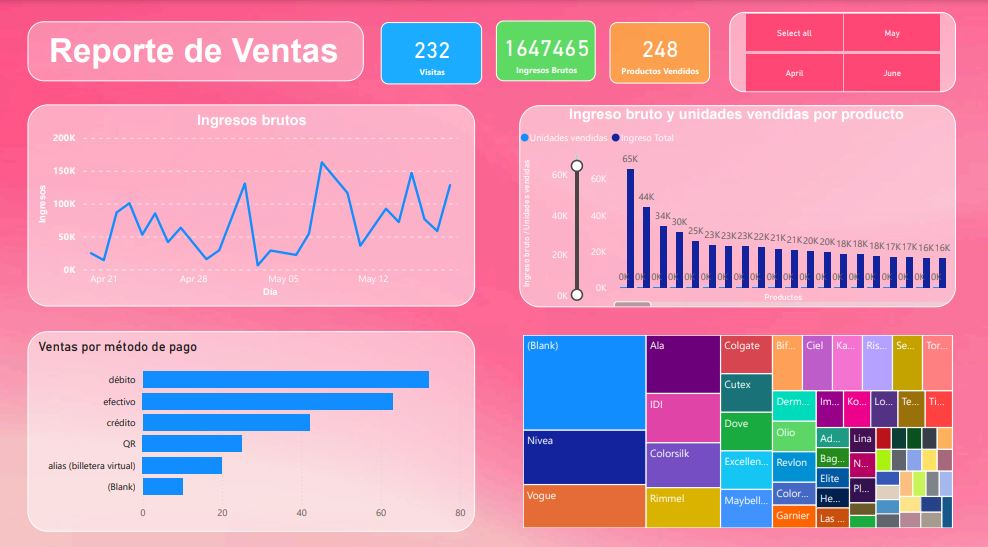

 

## Caso real: recolección de datos de venta, preprocesado y construcción de reporte en PowerBI

El siguiente proyecto tiene como objetivo recolectar datos de ventas reales de un negocio minorista y preprocesarlos para crear un dashboard en PowerBI que reporte información sobre las ventas realizadas. 

El dataset contiene la siguiente información detallada sobre las ventas, incluyendo datos sobre los clientes, productos, métodos de pago y precios:

- n_cliente: número de identificación de cada visita al local que realiza una compra. Este número permite rastrear las compras realizadas por cada persona y analizar el comportamiento de compra.

- fecha_y_hora: fecha y hora de la compra. Registra el momento exacto en que se realizó la transacción. Esta información es útil para análisis temporales, como identificar patrones de compra en diferentes momentos del día, días de la semana o épocas del año.

- nombre_producto: descripción textual del producto adquirido. Facilita la identificación del producto y permite realizar análisis sobre la popularidad de distintos productos.

- metodo_pago: método de pago utilizado para la compra. Especifica cómo se realizó el pago, por ejemplo, efectivo, tarjeta de crédito, tarjeta de débito, QR, etc. Esta información es importante para entender las preferencias de pago de los clientes.

- codigo_barras: identificador único del producto que puede ser escaneado para agilizar el proceso de venta y registro.

- precio_contado: precio del producto si se paga al contado.

- precio_lista: precio del producto si se paga mediante débito, crédito o QR.

- total_compra_efectivo: es la suma total de los precios de los productos adquiridos en una transacción específica cuando el pago se realiza en efectivo.

- total_compra_lista: es la suma total de los precios de los productos de la compra si se paga mediante débito, crédito o QR.

- 3_pagos: costo del producto cuando el pago se fracciona en tres pagos.

- marca: nmbre del fabricante o la marca del producto. Ayuda en el análisis de la preferencia de marca y en la gestión de inventarios de productos de distintas marcas.

- categoria: clasificación del producto en una categoría específica, como alimentos, bebidas, electrónica, etc. Esta clasificación es útil para análisis de ventas por categoría y para la organización de productos en el punto de venta.

Los datos fueron recolectados mediante la plataforma Airtable, que permitió un cómodo registro de los datos gracias a sus funciones intuitivas y amigables. Airtable facilitó esta tarea mediante características como la vinculación de registros de otras tablas, generación automática de ID's de fila y de datos datetime, y sincronización en tiempo real.

Una imagen estática del dashboard resultante se muestra a continuación:

 

*(Nota: hasta ahora solo se ha recolectado la información de las ventas del mes de abril y mediados de mayo. Con el paso del tiempo se obtendrá un dataset más extenso y se actualizará el dashboard)*

# Descripción del Dashboard de Ventas

 A continuación se describen las funcionalidades y componentes principales del dashboard:

1. **Título y Métricas Clave**:
   - **Título "Reporte de Ventas"**: Indica claramente el propósito del dashboard.
   - **Visitas (232)**: Número total de compras realizadas en el período analizado.
   - **Ingresos Brutos (1,647,465)**: Total de ingresos generados en el período analizado.
   - **Productos Vendidos (248)**: Número total de productos vendidos.

2. **Gráfico de Líneas: Ingresos Brutos**:
     Permite visualizar las fluctuaciones diarias en los ingresos brutos, identificando picos y valles que pueden indicar patrones estacionales o eventos específicos que influyen en las ventas.
   - **Eje Y (Ingresos)**: Muestra la cantidad de ingresos en diferentes intervalos.
   - **Eje X (Día)**: Representa el tiempo, dividido en días.
    

3. **Gráfico de Barras: Ventas por Método de Pago**:
     Facilita el análisis de las preferencias de pago de los clientes, permitiendo a los gestores ajustar estrategias para promover métodos de pago más convenientes o rentables.
   - **Métodos de Pago**: Débito, efectivo, crédito, QR, alias (billetera virtual).
   - **Cantidad de Ventas**: Indica el número de ventas realizadas por cada método de pago.

4. **Gráfico Combinado: Ingreso Bruto y Unidades Vendidas por Producto**:
     Combina las unidades vendidas y el ingreso generado por cada producto, proporcionando una visión clara de cuáles productos son más rentables y cuáles tienen mayor volumen de ventas.
   - **Eje Y (Izquierdo)**: Unidades vendidas.
   - **Eje Y (Derecho)**: Ingreso total en dinero.
   - **Eje X (Productos)**: Diferentes productos vendidos.

5. **Treemap: Marcas de Productos**:
     Visualización de las marcas más populares, ayudando a identificar qué marcas dominan las ventas y cuáles podrían necesitar estrategias de marketing adicionales.
   - **Marcas**: Diversas marcas de los productos vendidos (Ala, Colgate, Cutex, Nivea, etc.).
   - **Tamaño de los Bloques**: Representa la proporción de ventas de cada marca.
  

## Funcionalidades Interactivas

1. **Selectores de Meses (Select all, April, May, June)**: Ayudan a enfocar el análisis en períodos específicos, actualizando todas las visualizaciones de manera dinámica.
2. **Filtro de marcas**: El tree map funciona como un filtro que permite, al hacer click en uno de los rectángulos que representa una marca, la visualización de los datos agrupados según la misma.

3. **Interactividad General**: Los gráficos y visualizaciones permiten una interacción dinámica, como resaltar datos específicos al pasar el cursor sobre ellos, ofreciendo detalles adicionales sin necesidad de sobrecargar la vista principal. Estos mejoran la experiencia del usuario, permitiendo una exploración más detallada de los datos y una comprensión más profunda de los mismos.

## Conclusión

Este dashboard de ventas es una herramienta poderosa para monitorear y analizar las ventas de un negocio minorista. Con su diseño interactivo y visualizaciones claras, permite a los gestores y analistas obtener insights valiosos sobre el rendimiento de ventas, las preferencias de los clientes, y las tendencias de mercado. Los filtros de meses y las visualizaciones detalladas por producto y marca hacen de este dashboard una solución eficaz para la toma de decisiones informadas.

